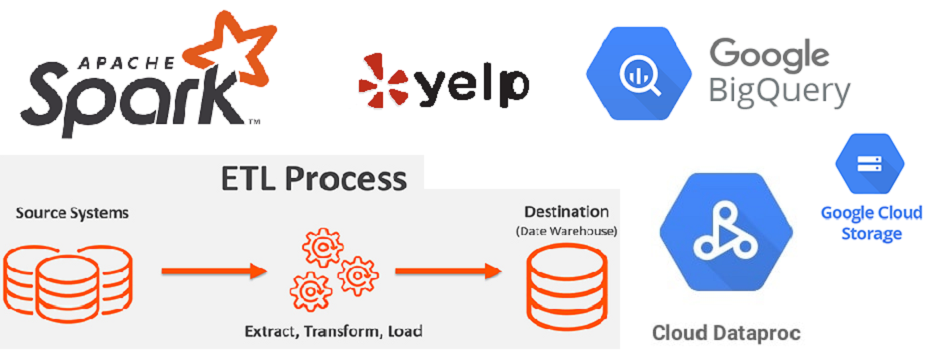

<!-- Add banner here -->


# Yelp ETL Pipeline in Apache Spark
<!-- Add buttons here -->


<!-- Describe your project in brief -->

# Table of contents
- [Description](#Description)
- [Infrastructure](#Infrastructure)
- [ETL Jobs](#ETL-Jobs)
- [Dataset](#Dataset)
- [Project Directory Structure](#Project-Directory-Structure)
- [Conclusion](#Conclusion)

## Description
In this project, we implement full tested and productionize ETL pipeline for 
yelp data on Google Cloud Dataproc in Apache Spark. It has several ETL jobs 
such as business categories, top restaurants, top users etc. and we build 
Circle CI pipeline to test each ETL jobs. 

## Infrastructure
We store raw yelp data of around 12 GB on Google Cloud Storage(GCS). Then, data is loaded on up and 
running Apache Spark cluster on Dataproc by ETL jobs. After data transformation, ETL jobs load the 
summary data on BigQuery.

#### **DataProc Configuration**

| Node          | RAM (GB) | Disk (GB) | vCPU     | 
| :------------ | :------: | :-------: | :------: | 
| # Master      | 15       | 500       | 4        | 
| # Worker-0    | 35       | 500       | 2        | 
| # Worker-1    | 35       | 500       | 2        |     


## ETL Jobs

#### i. Top Businesses
#### ii. Top Restaurants
#### iii. Top Users
#### iv. Business Categories

Refer Notebooks for several other jobs like user activity, user influence etc.


## Dataset
This dataset is a subset of Yelp's businesses, reviews, and user data. It was originally put together for the Yelp Dataset Challenge which is a chance for students to conduct research or analysis on Yelp's data and share their discoveries. In the most recent dataset you'll find information about businesses across 8 metropolitan areas in the USA and Canada.

Source: [Yelp dataset](https://www.yelp.com/dataset)

## Project Directory Structure

```
├── LICENSE
├── Makefile
├── Pipfile
├── Pipfile.lock
├── README.md
├── configs
│   ├── config.yaml
│   ├── config_test.yaml
│   ├── log4j.properties
│   └── logging.json
├── img
│   └── banner_etl.jpg
├── main.py
├── notebooks
│   ├── business_analysis.ipynb
│   ├── make_test_data.ipynb
│   └── user_review_analysis.ipynb
├── spark_submit.sh
├── src
│   ├── __init__.py
│   ├── app.py
│   ├── jobs
│   │   ├── __init__.py
│   │   ├── _jobs_abstract.py
│   │   ├── business_categories.py
│   │   ├── top_businesses.py
│   │   ├── top_restaurants.py
│   │   └── top_users.py
│   ├── logging
│   │   ├── __init__.py
│   │   └── _logging.py
│   └── utils
│       ├── __init__.py
│       ├── exception.py
│       └── validation.py
└── tests
    ├── __init__.py
    ├── conftest.py
    ├── jobs
    │   ├── __init__.py
    │   ├── test_business_categories.py
    │   ├── test_top_businesses.py
    │   ├── test_top_restaurants.py
    │   └── test_top_users.py
    └── test_data
        ├── expected_data
        │   ├── business_categories.csv
        │   ├── top_businesses.csv
        │   ├── top_restaurants.csv
        │   └── top_users.csv
        └── source_data
            ├── yelp_academic_dataset_business.json
            ├── yelp_academic_dataset_checkin.json
            ├── yelp_academic_dataset_review.json
            └── yelp_academic_dataset_user.json

12 directories, 44 files
```

## Conclusion
In this project, we implemented several ETL jobs such as business categories, top restaurants, 
top users etc. for yelp dataset in Apache Spark.

